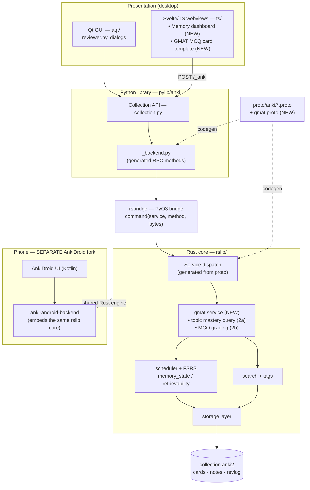

# PRD — GMAT Speedrun (Wednesday Milestone, No AI)

## Context

We are forking Anki to build a GMAT study app. The full project (per _Speedrun_) spans
Wednesday → Friday → Sunday, layering on AI and a readiness model later. **This PRD covers
the Wednesday milestone only and explicitly contains NO AI features** (no model calls, no
generated cards, no chatbot — that is a hard rule until Friday).

**Chosen exam: GMAT Focus Edition.** Total score 205–805 (steps of 10), three sections —
Quantitative, Verbal, Data Insights — 45 minutes each, section scores 60–90, computer-adaptive
(IRT/3PL). This PRD states the exam up front per spec §5; only the **memory** layer produces a
_score_ Wednesday (performance + readiness models are later, and require held-out data).

Wednesday's goal (spec §6) is to prove the foundation works end-to-end on **both** desktop and
phone, with real **Rust engine change(s)** and an **honest memory score** — _before_ any AI.
The hardest part of day one is the build and the mobile engine, so those are front-loaded.

### What this milestone must deliver (spec §6 "Due Wednesday")

Desktop:

1. Anki forked and building from source. _(Already achieved — builds and runs via `just run`.)_
2. A real Rust change working end-to-end: the diff + **3 Rust unit tests** + **1 test that calls it from Python**.
3. A review loop running on the GMAT deck (flashcard review + MCQ practice).
4. A memory model running, with an honest score: **a range + a give-up rule**.
5. A desktop installer that runs on a clean machine.

Mobile:
6. A phone app that builds and runs on a real device or emulator.
7. It loads the GMAT deck and runs a real review session **on the shared Rust engine**.
(Two-way sync NOT required Wednesday; reviewing the same deck is.)

Proof to capture: commit hash + clean-build recording, test results, clean-machine install
recording, and a screen recording of a phone review session.

---

## User Persona

**Maya — undergraduate business student preparing for the GMAT.**

- **Who:** A junior majoring in business/finance, planning to apply to MBA programs. Studying for
  the GMAT Focus Edition alongside a full course load — time is scarce and fragmented.
- **Context of use:** Studies at a desk between classes and on her phone in spare moments (bus,
  cafe, between lectures). She needs the _same_ deck and progress in both places.
- **Goals:**
  - Cover all three GMAT sections (Quant, Verbal, Data Insights) and know which she's weak in.
  - Get an _honest_ read on where she stands, not a flattering number she can't trust.
  - Make every short study block count, given limited time.
- **Behaviors / traits (grounded in the brainlift):**
  - Like most learners, she's a **poor judge of her own progress** (Subcat 5.3) — on open-ended
    flashcards she over-trusts a self-graded "I knew that." We keep flashcard self-grading for now
    (it's how Anki works, and objectively grading free recall needs AI we aren't adding yet), but the
    new **MCQ practice mode grades her objectively**, so part of her practice isn't self-judged
    (SPOV 2).
  - As a relative **novice** in some sections, she benefits from structure over open-ended freedom
    (Subcat 5.4, SPOV 2).
  - She is **time-pressured** and the GMAT itself is timed (Subcat 1.3) — she needs to recall terms
    _quickly_, and to _apply_ knowledge to new questions, not just recall slowly (Subcat 5.1/5.2). So
    a term counts as mastered only when she recalls it within a time budget.
- **Pain points this milestone addresses:**
  - "Am I actually ready, or just familiar with my cards?" → honest per-topic memory score **with a
    range**, and an explicit **give-up rule** that refuses to show a number when data is thin.
  - "Can I answer a real question, not just flip a card?" → MCQ practice mode with objective grading.
  - "Which section should I focus on?" → per-topic mastery surfaced from the Rust query.
  - "I want to study on my phone too." → the AnkiDroid companion runs the same deck on the same engine.
- **What she does NOT need Wednesday:** an AI tutor, AI-generated cards, AI grading of free-recall
  answers, or a predicted final/readiness score — all explicitly out of scope until later milestones.

## Two Study Modes (core product distinction)

| Mode                   | Card content                           | Graded by                                                       | Feeds the memory score?                                | Purpose                                                                   |
| ---------------------- | -------------------------------------- | --------------------------------------------------------------- | ------------------------------------------------------ | ------------------------------------------------------------------------- |
| **Flashcards (terms)** | Open-ended term/recall                 | **User self-marks** (Again/Hard/Good/Easy), as Anki today       | **Yes** — FSRS retrievability, gated by recall latency | Retrieval practice / **memory**                                           |
| **MCQ practice**       | Multiple-choice, stored correct answer | **System marks** right/wrong objectively (no AI, no self-grade) | **No**                                                 | Applying knowledge to new questions / **performance** (model comes later) |

Self-grading stays for flashcards now; AI-assisted grading of free recall is a _possible future_
addition. MCQ needs no AI because the answer key is stored. **The Wednesday memory score is
computed from flashcard terms only — MCQ results are recorded but never enter the memory score.**

## User Stories (Wednesday)

Written from Maya's perspective; each maps to a deliverable below.

**Flashcard review + memory score (Deliverables 2a, 3, 4)**

- As a GMAT student, I want to import a real GMAT deck and review term flashcards on my desktop,
  self-marking my recall, so that I practice retrieval the way Anki already supports.
- As a GMAT student, I want my term cards tagged by topic (Quant / Verbal / Data Insights and
  subtopics), so that my memory score can be tracked per section.
- As a GMAT student, I want a memory score per section shown with a range (not a single number),
  so that I understand how confident the estimate actually is.
- As a GMAT student, I want the app to refuse to show a score when it doesn't have enough of my
  review data yet, so that I'm not misled by a number based on three cards.
- As a GMAT student, I want a term to count as "mastered" only when I recall it _quickly_ (not just
  eventually), so that my memory score reflects the timed reality of the exam.
- As a GMAT student, I want to see which section I'm weakest in, so that I can spend my limited
  study time where it matters most.

**MCQ practice mode (Deliverables 2b, 3)**

- As a GMAT student, I want to answer multiple-choice practice questions and have the system tell me
  right or wrong, so that my performance isn't based on my own (often wrong) self-judgment.
- As a GMAT student, I want practice questions that are part of the system rather than ones I grade
  myself, so that I can't unconsciously inflate how well I'm doing.
- As a GMAT student, I want MCQ results kept separate from my memory score, so that "I know the
  term" and "I can answer a question with it" aren't conflated.

**Phone companion (Deliverables 6 & 7)**

- As a GMAT student, I want to review the same deck on my phone, so that I can study in spare moments.
- As a GMAT student, I want the phone app to use the same underlying engine as the desktop, so that
  my reviews behave consistently across both devices.

**Trust / installability (Deliverables 1 & 5)**

- As a GMAT student, I want to install the app on my own computer and have it just work, so that I
  can start studying without a developer setup.
- As a GMAT student, I want the app to give me a memory score even with no internet or AI features,
  so that I can rely on it offline.

_(Developer-facing, supporting the milestone's proof requirements:)_

- As the developer, I want the topic-mastery logic in the shared Rust engine and callable from
  Python, so that the same computation can power both the desktop and the phone build.
- As the developer, I want Rust unit tests + a Python integration test for each engine change, so
  that I can prove it works end-to-end and doesn't corrupt the collection or break undo.

---

## Architecture Overview

Anki is a multi-layered app: a Svelte/TypeScript frontend and a PyQt GUI sit on top of a thin Python
library (`pylib/anki`), which calls into a Rust core (`rslib`) through a PyO3 bridge (`pylib/rsbridge`).
All cross-layer calls are **protobuf RPCs** defined in `proto/` — the build generates a Python method
and a Rust dispatch entry for each. State lives in a single SQLite collection (cards, notes, revlog).
Our GMAT additions slot into this existing flow rather than introducing a new stack: a new `gmat`
protobuf service + Rust module, a memory-dashboard webview, and a "GMAT MCQ" note type/template.
The **same `rslib` core is embedded by the separate AnkiDroid fork**, so engine logic is shared with
the phone for free.

**Data flow for the memory score (Deliverable 2a/4), end to end:** the Memory dashboard (a webview
served by `aqt`'s mediasrv, or a Qt dialog) calls a `Collection` method → the generated
`_backend.py` method → `rsbridge.command(service, method, bytes)` → the generated service dispatch in
`rslib` → the new **`gmat` service**, which resolves term cards by topic tag (`search`), reads each
card's FSRS `memory_state` + revlog latency (`scheduler/fsrs`, `storage`), aggregates per topic, and
returns `{ mean_retrievability, range, mastered_cards, … }`. The dashboard renders the per-section
score, range, and give-up state. The **MCQ grading path (2b)** is the same round-trip in reverse: the
MCQ card template posts the chosen option to a `gmat` grading RPC that compares it to the stored
answer and submits the derived rating through Anki's existing undo-aware answer operation.

## Architecture Decisions

- **Topics = hierarchical tags.** `GMAT::Quant`, `GMAT::Verbal::CR`, `GMAT::Verbal::RC`,
  `GMAT::DataInsights`, plus subtopics (`GMAT::Quant::Algebra`). Tags live on notes
  (`rslib/src/notes/mod.rs`, `rslib/src/tags/mod.rs`) and are queryable via `SearchNode::Tag`
  (`rslib/src/search/mod.rs`). No schema change needed.
- **Two note types distinguish the modes.** Term flashcards use a standard note type (Basic/Cloze);
  MCQ uses a **new "GMAT MCQ" note type** with fields for the stem, options, and the **correct
  answer**, plus the topic tag. The memory mastery query filters to **term note types only** so MCQ
  cards never contaminate the memory score.
- **Deck layout = two decks by mode.** `GMAT::Terms` holds all flashcards; `GMAT::Practice` holds all
  MCQs. This lets the student run a pure flashcard session or a pure MCQ session (Anki studies one
  deck subtree at a time). **Topics are tags on the notes in both decks** (`GMAT::Quant`, …), so the
  memory score aggregates per topic regardless of deck. The memory query scopes to the term note type
  (equivalently, the `GMAT::Terms` deck).
- **Memory metric = FSRS retrievability** of term cards (brainlift Subcat 3.2). Computed from the
  card's stored `FsrsMemoryState` (`rslib/src/card/mod.rs:96-125`) via the `fsrs` crate's
  `current_retrievability_seconds(...)` (see `rslib/src/stats/card.rs:56`,
  `rslib/src/stats/graphs/retrievability.rs:34`).
- **Desktop = this repo** (rslib + pylib + aqt + ts). **Mobile = a separate AnkiDroid fork** that
  embeds the same Rust backend — this repo has no mobile/iOS/FFI build target.
- **Content sources (no model-generated cards — no-AI rule):**
  - _Term flashcards:_ a downloaded, license-compatible GMAT `.apkg` (existing shared deck), imported
    then tagged by topic.
  - _MCQ practice questions:_ an **existing, license-compatible MCQ question bank** (an open question
    set or an `.apkg` of MCQ-style cards), imported and **mapped into the new "GMAT MCQ" note type**
    (stem, options, correct answer, topic) — not hand-authored, not generated.

---

## Deliverable 1 — Fork builds from source ✅

Already done: `just run` builds pylib + qt and launches Anki. Prerequisites installed this session
(`just`, `rust`/`cargo`, `n2`; `~/.cargo/bin` added to PATH). **Action remaining:** confirm the
fork is a public **AGPL-3.0-or-later** repo with attribution to Anki (spec §2 license rule), and
record the commit hash used for the milestone build.

---

## Deliverable 2 — Rust engine change(s)

Two engine changes, **strictly sequenced**. 2a is the milestone's guaranteed Rust change; 2b is
started only after 2a is fully working and tested, and has a non-Rust fallback so it can never block
the deadline.

### 2a — Topic Memory Mastery Query _(primary — build & test first)_

**The change.** A new **read-only** backend RPC that returns, per topic (tag), aggregate **memory**
statistics for **term flashcards only**: `{ topic, total_cards, reviewed_cards, mastered_cards,
mean_retrievability, retrievability_low, retrievability_high }`, where a card is **"mastered" =
retrievability ≥ `R_threshold` AND its recent correct reviews were answered within a topic time
budget `T_topic`**. (The self-grade still drives FSRS recall as today; the latency check only gates
the _mastered_ flag — it does not change scheduling or override the user's rating.)

**Why this design (maps to the brainlift):**

- _Time constraints (Subcat 1.3):_ the GMAT is timed, and "study that never involves timed conditions
  is not considering all the important exam factors." Anki records answer latency but ignores it — a
  term you can only recall _slowly_ isn't truly mastered for a timed exam, so latency gates mastery.
- _Honesty rule (spec §1/§4) + measurement uncertainty (Subcat 3.1, Baker/IRT):_ report a **range**,
  not a false-precision point — uncertainty is first-class.
- _Limited study time + weak-topic focus (persona; SPOV):_ per-topic breakdown tells Maya where to
  spend time.
- It is the spec's "Mastery query" option (§7a), and it directly powers Deliverable 4.

**Why in Rust, not Python (spec §7a one-pager):** reads FSRS memory state for up to 50,000 cards and
must hit the dashboard speed targets (spec §10); doing it in the Rust core keeps it fast, off the UI
thread, and available to **both** desktop and the AnkiDroid build (shared engine), with the memory
metric defined in exactly one place.

**Files to touch** (pattern verified against the existing `get_card` RPC):

- **Proto:** new `proto/anki/gmat.proto` — service method + request (tag-prefix filter, thresholds)
  and response messages above.
- **Rust impl:** new module `rslib/src/gmat/mod.rs` (+ `service.rs`) implementing the generated
  service trait on `Collection` (mirror `rslib/src/card/service.rs:19`). Reuse: tag/card resolution
  via `SearchNode::Tag` + `Collection::find_cards` (`rslib/src/search/mod.rs`); retrievability via the
  `fsrs` crate as in `rslib/src/stats/graphs/retrievability.rs`; per-card answer latency from the
  revlog (read the same way `rslib/src/stats/card.rs` reads review times) for the time-budget gate.
  **Filter to term note types** so MCQ cards are excluded.
- **Register module:** wire `gmat` into `rslib/src/lib.rs` and the services list.
- **Build note:** a new `.proto` requires a full `just check` build (regenerates
  `out/pylib/anki/_backend_generated.py` and the Rust service dispatch), not just `cargo check`.

**The "range":** `mean_retrievability` plus a distribution-based spread (e.g. 10th–90th percentile of
per-card retrievability, or mean ± a count-scaled margin). Honest, no fabricated precision.

**Tests (spec §7a: ≥3 Rust + 1 Python — 4 Rust here):**

- Rust #1: a high-retrievability term card with **fast** recent reviews → counts as `mastered`.
- Rust #2: a high-retrievability term card whose recent correct reviews were **over `T_topic`** → NOT
  `mastered` (proves the time-aware gate).
- Rust #3: a topic below the give-up threshold → returns abstain/insufficient (or zero
  `reviewed_cards`), proving the give-up rule at the engine level.
- Rust #4: MCQ cards in the same topic are **excluded** from the memory aggregation.
  _(Use `Collection::new()` + `CardAdder`/`NoteAdder`/`DeckAdder` helpers — see test modules in
  `rslib/src/scheduler/queue/builder/mod.rs` and `rslib/src/card/service.rs`.)_
- Python #1: in `pylib/tests/`, `getEmptyCol()`, add tagged term notes, review some, call the new
  `col._backend.<method>()`, assert per-topic numbers.

**Undo / no-corruption (spec §7a):** read-only — issues no writes, so undo and integrity are
unaffected by construction. Document this; optionally assert collection state is unchanged across the call.

### 2b — MCQ Objective Grading in the engine _(next step — only after 2a is solid)_

**The change.** A `GMAT MCQ` note type (stem, options, stored correct answer, topic) plus engine-side
**objective grading**: a backend RPC that, given a card and the chosen option, compares it to the
stored correct answer, returns correct/incorrect, and records the attempt (correctness + latency),
auto-deriving the review rating (correct → Good, incorrect → Again) so the **user never self-grades**
MCQs. Writes go through Anki's existing undo-aware operations.

**Why (maps to the brainlift):** SPOV 2 + Subcat 5.3 (users are poor self-graders → take the
grading reins for objective items); Subcat 5.1/5.2 (practicing application on new questions, not just
recognition of a term, is the memory→performance bridge). Putting grading in Rust keeps it on the
shared engine for the phone too.

**Sequencing & fallback (per direction):**

- Do **not** start 2b until 2a's diff, 3 Rust tests, and Python test all pass and undo is verified.
- If engine-side grading proves too costly for the deadline, **fall back** to a non-Rust
  implementation: a custom card template with JavaScript that checks the choice against the answer
  field (precedent: Anki's built-in `{{type:Field}}` auto-checking) and Python wiring to record the
  result and submit the rating. This keeps the MCQ _feature_ shippable Wednesday even if it isn't in
  Rust. (Trade-off: a non-Rust MCQ grader doesn't count as the "real Rust change" — but 2a already
  satisfies that requirement, so the milestone is safe either way.)
- 2b gets its own Rust tests (correct choice → correct + Good; wrong choice → incorrect + Again) and
  a Python test, **and** an undo/no-corruption check since it writes.

**Hard constraint:** MCQ attempts/results must **not** feed the memory score (Deliverable 4). They
flow through their own note type and are excluded by 2a's filter.

---

## Deliverable 3 — Review loop on the GMAT deck (both modes)

1. **Terms:** import a downloaded GMAT `.apkg` into the **`GMAT::Terms`** deck via the existing apkg
   importer (`rslib/src/import_export/package/apkg/import/mod.rs:52`; Qt dialog
   `qt/aqt/import_export/importing.py`).
   **MCQs:** import an existing license-compatible MCQ bank into the **`GMAT::Practice`** deck and
   **map its fields into the new "GMAT MCQ" note type** (via apkg import, or CSV import —
   `rslib/src/import_export/text/csv/import.rs` — if the bank is tabular). No hand-authoring, no generation.
2. Tag notes by topic (bulk add via `qt/aqt/operations/tag.py`).
3. **Flashcard review:** the standard reviewer (`qt/aqt/reviewer.py:149`) runs the loop; answering
   flows UI → `operations/scheduling.py` → `col.sched.answer_card` → Rust
   (`rslib/src/scheduler/service/mod.rs:232`). No code change — wiring + content.
4. **MCQ practice:** the same reviewer renders MCQ cards via the MCQ template; selecting an option is
   graded objectively (2b engine RPC, or the template/Python fallback) and auto-submits the rating.

---

## Deliverable 4 — Memory model with honest score (range + give-up rule)

Desktop surface (Qt/web page or simple dialog) showing the three GMAT sections, each with:

- point estimate = mean topic retrievability **of term flashcards** (from 2a's RPC),
- the **range** (low/high from the RPC),
- **last-updated** timestamp and the **main reasons** (e.g. # reviewed / total),
- **give-up rule:** show no score for a topic until it has ≥ `N` graded reviews **and** ≥ `M` distinct
  cards reviewed (state exact numbers in the README). Below the line → "Not enough data yet."

Scope guards:

- **Memory only, terms only.** Do NOT include MCQ results, performance, or readiness (separate
  measurements; later milestones; need held-out data). The display must not blend them.
- MCQ practice _exists_ Wednesday and records results, but there is **no performance/readiness model**
  this milestone.

---

## Deliverable 5 — Desktop installer (clean machine)

Use the existing Briefcase installer (`qt/installer/`, mac/linux/windows templates). Build the
platform package, install on a clean machine/VM, launch, and confirm it runs with **no AI** and still
shows a memory score. Document the exact `just` recipe(s) used (`just wheels` + the installer build).

---

## Deliverable 6 — Mobile (separate AnkiDroid fork) — _tracked section_

This repo is desktop-only, so the phone companion is a **separate AnkiDroid fork** embedding the same
Rust backend ("share the engine, don't rewrite it").

Wednesday mobile scope (minimal — no sync, no AI):

1. Fork AnkiDroid (AGPL); build the APK and run on an emulator or real device. ✅ _(done — fork builds
   and runs on the emulator)_
2. Load the GMAT deck via **offline `.apkg` import** (drag-and-drop onto the emulator or
   `adb push … /sdcard/Download/`, then import in AnkiDroid). **No AnkiWeb sync needed** — sync is a
   Friday+ requirement and a cold sync is slow; keep it offline. Dry-run the import→review path with a
   small sample `.apkg` first so the real GMAT deck is plug-and-play.
3. Run a **real review session** on the shared engine; screen-record it.

Notes / open items:

- Confirm the AnkiDroid version pins a Rust backend compatible with this fork's engine.
- Whether the 2a/2b engine changes are compiled into the Android backend Wednesday is **optional**
  (the spec only requires "loads the deck and runs a review session" on mobile this milestone).
  Shipping the engine changes to mobile can wait until the engine is shared/synced (Friday+).

---

## Explicitly Out of Scope (Wednesday)

- **All AI** — card generation, AI tutoring, embeddings, LLM evals, **and AI grading of free-recall
  flashcards** (a possible future addition). Hard rule until Friday.
- **Performance and readiness _models/scores_** (need held-out data; Friday/Sunday). _(MCQ practice
  mode itself is in scope; predicting a performance/readiness number is not.)_
- Two-way phone↔desktop sync and conflict resolution (Friday).
- Scheduler/queue reordering and any change to FSRS intervals (kept out on purpose to protect undo/integrity).

---

## Verification & Proof Checklist

- [ ] `just check` passes (fmt + build + lint + tests) after the engine change(s).
- [ ] `just test-rust` shows 2a's 3 Rust tests passing; `just test-py` shows 2a's Python test passing.
- [ ] (If 2b built in Rust) its Rust + Python tests pass, including an undo/no-corruption check.
- [ ] Clean-build recording captured; commit hash recorded.
- [ ] GMAT `.apkg` imported, topic-tagged; a desktop **flashcard** review session recorded.
- [ ] An **MCQ** practice question recorded being graded right/wrong by the system (not the user).
- [ ] Memory page shows per-section score + range; abstains below the give-up threshold (demo both states).
- [ ] Verified the memory score is unaffected by MCQ results (terms-only).
- [ ] Desktop installer built and installed on a clean machine/VM; launches and shows a score with AI off.
- [ ] AnkiDroid fork APK builds; loads the GMAT deck; phone review session recorded.
- [ ] README states: exam (GMAT Focus), AGPL-3.0-or-later + Anki attribution, build steps (both apps),
      the give-up rule numbers, the two study modes, and the list of upstream files touched.

---

## Technical Dependencies & Gotchas

- **FSRS must be enabled on the GMAT decks** for retrievability to exist. The memory metric reads
  `card.memory_state`, which is populated by **FSRS** (default in recent Anki / this fork's 26.05),
  _not_ the legacy SM-2 scheduler. Confirm FSRS is on before relying on the score.
- **Freshly imported cards have no memory state until they're reviewed** (and FSRS params computed).
  A just-imported deck will legitimately show "Not enough data yet" for every topic — that is the
  give-up rule working, but it means the **demo must include some reviews first** (and possibly an
  FSRS "Optimize") before any score appears. Plan the proof recording around this.
- **Define "recent correct reviews" precisely** for the time gate when implementing 2a (e.g. the most
  recent review per card, or the last K), so the `mastered` flag is deterministic and unit-testable.

## Open Tasks / Risks

- **GMAT topic taxonomy:** write the canonical tag list once, up front — the three sections plus the
  subtopics you'll actually use (e.g. `GMAT::Quant::Algebra`, `GMAT::Verbal::CR`, `GMAT::Verbal::RC`,
  `GMAT::DataInsights::DataSufficiency`). This is both the tagging scheme and the per-section score
  grouping; keep it small for Wednesday.
- **Demo-state prep:** before recording proof, review enough cards in one topic to cross the give-up
  threshold (shows score + range) and leave another topic sparse (shows the abstain state), so both
  states are demonstrable in one recording.
- **Git hygiene:** do the work on a feature branch off the fork's `main`.
- **Sequencing discipline:** finish and fully test 2a before touching 2b. If 2b in Rust runs long,
  switch to the template/Python MCQ fallback — the milestone's "real Rust change" is already met by 2a.
- **Content sourcing:** identify (a) a downloaded GMAT term `.apkg` and (b) a license-compatible MCQ
  question bank; confirm both licenses permit use; budget time to map the MCQ bank into the "GMAT MCQ"
  note type (field mapping / CSV conversion) and to topic-tag both if they arrive untagged. _(Finding
  a license-compatible MCQ bank with known-correct answers is the main content risk — line it up early.)_
- **Thresholds:** pick concrete values for `R_threshold`, the per-topic time budget `T_topic`, and the
  give-up `N`/`M`; state them in the README.
- **`.proto` build cost:** the new proto forces a full `just check` rebuild — sequence it before mobile work.
- **AnkiDroid build setup** (Android SDK/NDK, Rust Android targets) is the riskiest Wednesday item —
  start it early, in parallel with desktop.
